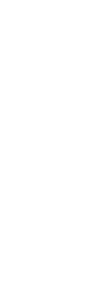
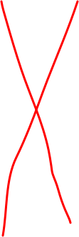
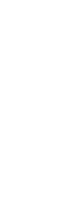
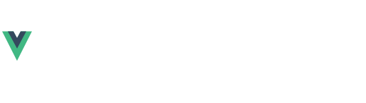
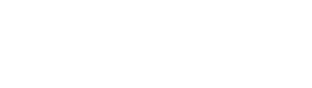

---
# You can also start simply with 'default'
theme: default
# random image from a curated Unsplash collection by Anthony
# like them? see https://unsplash.com/collections/94734566/slidev
background: ./assets/background/Slide-16_9-1.webp
# some information about your slides (markdown enabled)
title: Что такое SSR!
info: |
    ## Slidev Starter Template
    Presentation slides for developers.

    Learn more at [Sli.dev](https://sli.dev)
# apply unocss classes to the current slide
fonts:
    sans: Robot
    serif: Robot Slab
    mono: Fira Code
class: text-start flex content-between
# https://sli.dev/features/drawing
drawings:
    persist: false
# slide transition: https://sli.dev/guide/animations.html#slide-transitions
transition: slide-left
# enable MDC Syntax: https://sli.dev/features/mdc
mdc: true
# take snapshot for each slide in the overview
overviewSnapshots: true
---

# Что такое SSR!

(Server Side Rendering)

 

Какие есть ещё Rendering

Зачем нам это нужно

Как это работает

<!-- И может ну его нахер останемся на PHP? -->

---

# Что бы понять в чём прикол SSR

Нужно понимать какие есть ещё Rendering и в чём их различия

 
 
 
 
 
 
 
 
 

<v-click>

<v-drag pos="180,130,700,_,0">
 <video controls='false' autoplay="autoplay" muted loop width="280" height="174" src="./assets/2/ryan-gosling.mp4"></video>
</v-drag>

-   SSG (Static Site Generation)

-   CSR (Client Side Rendering)

-   SSR (Server Side Rendering)

</v-click>

---

# Генератор статики SSG (Static Site Generation)

Очень редкий зверь, но невероятно приколдесная штука. По сути это генератор html страниц который может собрать многостраничный сайт без бека)

### Как это работает:

<v-drag v-click pos="260,125,700,_,-2">

( Допустим нужно вывести список победителей с фильтром и поиском )

</v-drag>
 

  
  
  
  

<v-drag v-click pos="660,190,700,_,2">
  <video controls='false' autoplay="autoplay" muted loop width="280" height="174" src="./assets/ssg/the-rock-dwayne-johnson.mp4"></video>
</v-drag>

---

# Плюсы минусы SSG

Генератор статических страниц

 

| 🟩 Плюсы 🟩                      | 🟥 Минусы 🟥 |
| -------------------------------- | ------------ |
| Нету бека                        | Нету бека    |
| Скорость загрузки                |              |
| SEO Friendly (если 100% статика) |              |
| Легко развернуть и настроить     |              |

 
 

Ссылки: [Astro](https://astro.build/) | [11ty](https://www.11ty.dev/) | [Gatsby.js](https://www.gatsbyjs.com/)

---

# Старый добрый CSR (Client Side Rendering)

Мы все этим пользуемся когда используем js фремворки или библиотеки

 

### Как это работает:

<v-drag v-click pos="260,125,700,_,-2">

( Тоже выводим список победителей )

</v-drag>
 

  
  
  
  
  
  

<v-drag v-click='[7,8]' pos="520,190,700,_,-2">
  

    
    
  

</v-drag>

<v-drag v-click='9' pos="520,190,700,_,-2">
  <video controls='false' autoplay="autoplay" muted loop width="280" height="174" src="./assets/csr/maybe-iffy.mp4"></video>
</v-drag>

---

# Плюсы минусы CSR

Это по сути любые js фреймворки

 
 
 

| 🟩 Плюсы 🟩                  | 🟥 Минусы 🟥            |
| ---------------------------- | ----------------------- |
| Легко развернуть и настроить | SEO                     |
|                              | Проблемы с архитектурой |

 
 
 
 

Ссылки: [Svelte](https://svelte.dev/) | [Vue.js](https://vuejs.org/) | [React.js](https://react.dev/)

---

# И сигма из всей тусы SSR (Server Side Rendering)

Формируем страницу до того как клиент её увидит!

 

### Как это работает:

<v-drag v-click pos="260,125,700,_,-2">

( Тоже выводим список победителей )

</v-drag>
 

  
  
  

<v-drag v-click pos="560,220,700,_,2">
  <video controls='false' autoplay="autoplay" muted loop width="280" height="174" src="./assets/ssr/black-friday.mp4"></video>
</v-drag>

---

# Как работает SSR ?

По сути мы просто крутим JavaScript на сервере, который частично или полностью выполняет работу бекенда

 

<v-click>

`html` генерируется на сервере с помощью `Bun.js` или `Node.js`, JavaScript формируется во время сборки проекта. Из за этого клиентский JavaScript знает где и какой `html` нужно ожидать и что с ним делать дальше. Это называется `hydration / re-hydration`

</v-click>

<v-drag v-click pos="150,310,520,150,0">
  
</v-drag>

<v-drag v-click pos="150,310,520,150,0">
  
</v-drag>

<v-drag v-click pos="150,310,520,150,0">
  
</v-drag>

        

<v-click>

> Важно учитывать что часть js выполняется на сервере а часть на клиенте

</v-click>

<v-drag v-click pos="730,300,700,_,2">
  <video controls='false' autoplay="autoplay" muted loop width="180" height="174" src="./assets/ssr/wtf-is-going-on-confused.mp4"></video>
</v-drag>

---

# Плюсы минусы SSR

Laravel + js фреймворки и никаких `.blade.php`

 
 

| 🟩 Плюсы 🟩                     | 🟥 Минусы 🟥        |
| ------------------------------- | ------------------- |
| SEO Friendly                    | Сложная настройка   |
| Удобно организовать архитектуру | Современные сервера |
| Поное разделение бек фронт      |                     |
| Бек на Laravel                  |                     |

 
 

Ссылки: [Inertia.js](https://inertiajs.com/)

---

# Зачем нам нужен SSR ?

Спойлер: это нужно только для seo ну, и немного для производительности но если ты wb или ozon

-   Можно полностью писать фронт на js фреймворках без каких либо ограничений
-   На прямую передавать данные в js фреймворк во момент формирования страницы на сервере
-   Вся логика формирования html на стороне сервера, но только при первой загрузки страницы

 

#### Если во всём этом разобраться то это очень удобно и быстро разрабатывается и масштабируется
